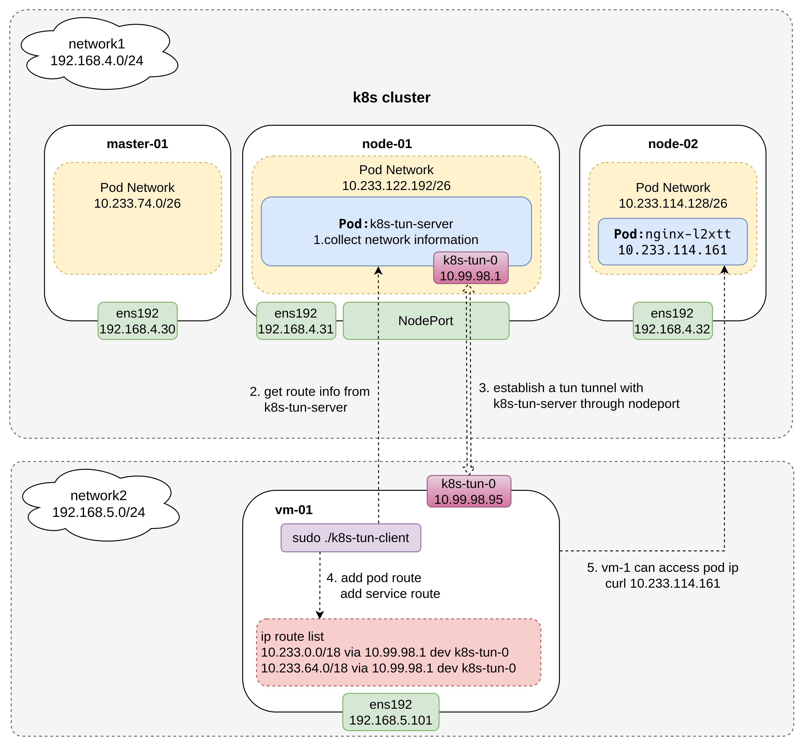

# k8s-tun

### Introduction

Access k8s pod ip, service ip



### Usage

**server**

```bash
kubectl apply -f https://raw.githubusercontent.com/yzxiu/k8s-tun/master/deploy.yaml
```

**client**

Linux & Mac

```shell
# download client
wget https://github.com/yzxiu/k8s-tun/releases/download/0.86-3/client-darwin-amd64-086-3
chmod +x client-linux-amd64-086-3

# start client
sudo ./client-linux-amd64-086-3 -s <k8s-node-ip>:30011
```

Windows
```log
// 1
download [client-windows-amd64-086-3.exe](https://github.com/yzxiu/k8s-tun/releases/download/0.86-3/client-windows-amd64-086-3.exe)
// 2
install the attached tap-windows-9.24.2-I601-Win10 driver
// 3
right click `client-windows-amd64-086-3.exe` and run as administrator
```

### Notice


Advantages: In theory, all cni plug-ins are supported, and vm-01 can be in a different network from the k8s cluster, so it is more flexible to use. The client does not need to configure kubeconfig

Cons: Traffic is tunneled (similar to openvpn), less efficient.

Tunnel implementation refers to https://github.com/net-byte/vtun